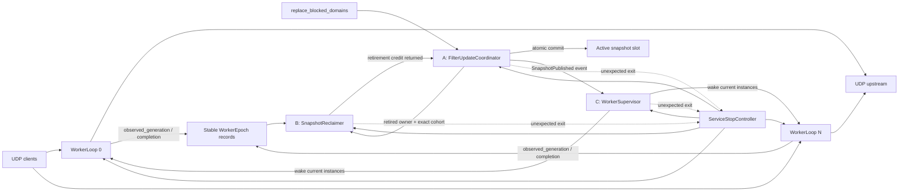
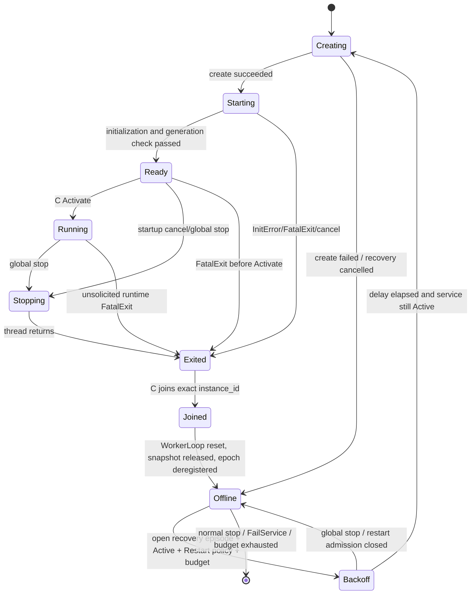

# DNS_PRO 后续实施计划

本文档从阶段 10 完成后的代码状态出发，统一记录已经确认的产品边界、控制面架构、快照生命周期、worker 恢复语义和后续实施顺序。后续若改变这里的协议或生命周期契约，必须在同一阶段同步修改本文档、`docs/MVP_SCOPE.md` 和对应测试。

当前实施状态：阶段 13 的 worker-local snapshot、generation 安全点、精确 publication cohort、一个普通 retirement credit、独立 terminal record、专用回收线程 B 以及 A/B/C 正常/故障停机协议已经完成，下一阶段为阶段 14 的可配置 worker 恢复与 degraded 健康状态。规则输入现在有 100,000 条/16 MiB 单命令硬上限、64 MiB 排队字节上限，grace stall 默认 30 秒且只触发诊断性 fatal、绝不强制回收。本地默认/严格 socket、ASan 和 UBSan 矩阵已覆盖 12 个 CTest target；TSan target 可以构建，但该宿主直接启动 GCC TSan 时会在进入测试逻辑前报 `unexpected memory mapping`。使用 `setarch x86_64 -R` 后，generation、filter-reload、lifecycle 和含持续 UDP 查询的 reactor 测试均已通过且无 TSan 报告；完整 preset 仍应在原生兼容的 CI 地址空间复跑。本地仍缺少 `clang++` 和 `dig`，因此 libFuzzer target 的实际构建运行及 `dig +noedns` 手工验收也须在具备这些工具的 CI/主机补跑；等价的通用 parser/service-boundary target、raw OPT 首包和 A/AAAA UDP 转发回归已经纳入代码库。

## 1. 已确认的决策

### 1.1 协议范围

1. MVP 只支持经典 UDP DNS，不支持 EDNS，也不做 UDP 截断后的 TCP fallback。
2. 经典 UDP DNS 报文的统一上限是 512 字节。接收缓冲区的“512”是用户态单个报文缓冲区大小，不是 socket 的 `SO_RCVBUF`。
3. 下游收到大于 512 字节的数据报时：
   - 若固定头部前缀足以表明它是查询（`QR=0`），只使用 transaction ID 和必要标志构造 header-only `FORMERR`；
   - 若固定头部前缀表明它是响应（`QR=1`），静默丢弃；
   - 任何情况下都不解析或转发被截断的部分报文。
4. 上游收到大于 512 字节的数据报时，将它视为无效响应并丢弃；对应 pending query 继续等待。只有在等待窗口内没有后续合法响应时，才走正常超时并向客户端返回 `SERVFAIL`，不能因单个 oversized 数据报立即失败。
5. 长度不超过 512 字节、语法合法但包含 MVP 不支持的 additional record 或 OPT RR 的查询返回 `NOTIMP`。如果 additional/OPT 的 DNS RR 外壳畸形，例如 owner/type/class/TTL/RDLENGTH 被截断、RDLENGTH 越界、section count 或 trailing bytes 不一致，则返回 `FORMERR`。MVP 不解析 OPT RDATA 内部的 EDNS option code/length；RR 外壳完整的 OPT 一律按 unsupported 处理。oversized 规则优先于完整语法解析。
6. 长度不超过 512 字节且 `TC=1` 的合法上游响应仍透明转发；MVP 不尝试 TCP fallback。
7. “不支持 DNSSEC”只表示不协商 EDNS/DO、不验证 DNSSEC。下游查询的 `AD`/`CD` 位在转发上游时原样保留，任一置位都使请求绕过地址缓存；上游响应的 `AD`/`CD` 原样透明返回。本地产生的 error/cache response 保留 query 的 `CD` 和既有 RD/opcode 契约，但 `AD` 必须为 false，不能仅因 query 设置 AD 就声称本地数据已认证。

代码中只保留一个数值来源，并用语义别名表达各路径的用途：

```cpp
inline constexpr std::size_t kClassicDnsUdpPayloadLimit = 512;

inline constexpr auto kDownstreamReceiveBufferSize = kClassicDnsUdpPayloadLimit;
inline constexpr auto kUpstreamQueryBudget         = kClassicDnsUdpPayloadLimit;
inline constexpr auto kUpstreamReceiveBufferSize   = kClassicDnsUdpPayloadLimit;
inline constexpr auto kDownstreamResponseBudget    = kClassicDnsUdpPayloadLimit;
```

`recvmsg(..., MSG_TRUNC)` 用于获得原始 UDP 数据报长度，因此 512 字节用户缓冲区仍能可靠识别 oversized 数据报。`WorkerLoop`/`UpstreamChannel` 在传输边界应用该 service limit；查询序列化、接收缓冲和下游响应 writer 都使用同一上限。通用 `dns::protocol` parser/limits 不把 512 硬编码为 wire-format 上限，仍可供离线工具和 fuzzing 解析更大的合法 DNS wire；服务只在传输边界检查通过后调用 parser，或向 parser 显式传入 512 的 service budget。`send_response()` 再做最后一道防御性检查：任何大于 512 字节的响应不得发送，并记录诊断计数。

错误响应若无法在预算内保留 question，退化为 header-only 响应。缓存响应若无法在 512 字节内无损重建，则把该次缓存命中降级为 cache miss 并转发上游，不能发送半截响应。

### 1.2 快照所有权与优化门槛

1. 第一版先保留 `std::shared_ptr<const FilterContext>` 作为快照所有权机制，只消除每个请求上的原子加载和引用计数：每个 worker 在安全点切换一次本地快照，处理请求时只读本地快照。
2. retired 快照的强引用保存在 DNS-owned stable retirement record 中，由专用回收线程 B 处理。worker 释放本地旧快照时，该 record 仍持有它，因此析构不会落在 worker 热路径上；B 意外退出也不会因线程栈展开提前释放 owner。
3. 在有数据证明 `shared_ptr` 仍是性能瓶颈之前，不改成裸指针 epoch RCU。阶段 15 是明确的性能决策门；若收益不足，就保留安全、简单的 `shared_ptr + generation + 精确 cohort` 方案。
4. 过滤函数必须同步完成，不能跨 `co_await` 持有树内指针、迭代器或引用，也不能把这些借用返回给调用者。

### 1.3 启动、运行期恢复与配置

1. 启动是 all-or-nothing。只要任一 worker 或必需的控制面线程初始化失败，`DNS::start()` 就回滚整个启动尝试并返回结构化错误。
2. DNS 库本身不调用 `std::exit()`；可执行程序的 `main` 收到启动失败后打印原因并以非零状态退出。这满足“启动期任一 worker 失败即退出程序”，又保持库 API 可测试。
3. worker 自动恢复只适用于服务已经进入 `Active` 后发生的运行期 fatal exit，并由显式配置决定。阶段 12/13 以 `FailService` 作为唯一实际行为；阶段 14 才启用可选的 `Restart`：

```text
worker_failure_policy = Restart | FailService
restart_max_attempts
restart_initial_backoff
restart_max_backoff
restart_stability_window
```

4. 启动期失败、正常 stop、全局 fatal stop 都不能误入 worker restart 分支。
5. 删除 `manager_count`，不保留兼容期。改用表达能力对应真实语义的配置项：

```text
runtime_updates_enabled
worker_failure_policy
restart_max_attempts
restart_initial_backoff
restart_max_backoff
restart_stability_window
```

### 1.4 控制面执行模型

控制面使用三个职责单一的专用 `std::jthread`，不使用普通 FIFO 线程池：

- A — `FilterUpdateCoordinator`：接收完整规则集，串行构建候选快照并串行发布；
- B — `SnapshotReclaimer`：等待精确 grace period，在线程 B 上析构 retired 快照；
- C — `WorkerSupervisor`：管理 worker 的创建、ready、join、运行期恢复和健康状态。

A 是事件驱动的；没有规则变化时不周期性重建树。若未来增加远端规则源，另设 `RuleSourceRefresher` 产生更新命令，不把抓取、构建和发布混成一个职责。

当 `runtime_updates_enabled=false` 时，不创建 A/B；初始静态快照在所有 worker join 后由 DNS teardown 路径析构。C 始终存在。启用运行期更新时，A/B/C 各自使用专用线程；不把这三个角色解释成可配置的多个 manager。

A、B、C 任一线程在运行期意外退出都属于服务级 fatal error。三者顶层必须捕获所有异常，并通过不依赖 C 事件循环存活的 `ServiceStopController::fail_service()`：

1. 以原子方式记录第一个 fatal 原因；
2. 关闭新更新和 restart admission；
3. 向 worker 发停止请求，并向仍存活的控制角色发送各自的 fatal-drain 命令并唤醒阻塞点；不能简单 request-stop 后让 A/B/C 立即退出，因为正常回收仍依赖它们完成 seal、join 和 drain；
4. 使生命周期进入 fatal teardown；
5. 最终由 `join()`/析构路径完成资源回收并落到 `Failed`。

线程只是执行者，不是控制资源的最终 owner。active slot、publication journal、retired owner queue、WorkerSupervisor 对象、WorkerRecord registry 和每个 worker 的稳定 stop endpoint 都由 DNS 拥有的 `ControlPlaneState` 持久保存，不能放在 A/B/C 的线程栈上。`fail_service()` 只记录原因、关闭 admission、发 stop 和唤醒；故障线程绝不 join 自己。调用 `join()`/析构的外部线程在先 join 已故障角色后，才可按第 5.6 节的 emergency takeover 规则接管其唯一写者职责。

进程内恢复只覆盖可正常退出并可 join 的 worker。段错误、内存破坏或不可 join 的死线程不宣称能由进程内 supervisor 修复，交给 systemd、容器或其他外部 watchdog 重启整个进程。

### 1.5 更新提交、回收信用与停机

1. 将 active snapshot 的原子 exchange 定义为不可逆的 commit point。
2. commit 前构建失败、取消或 shutdown：旧快照和 generation 完全不变，命令返回明确错误。
3. commit 后命令不能再返回 `Cancelled` 或声称回滚。它等待本次发布捕获的精确参与者集合完成切换；即使此时开始 shutdown，只要这些参与者已经 ack，或已 join、释放本地快照并注销，就返回成功。B 先发布 cohort convergence 供 A/successor 完成 future，再在 B 线程析构 sole old owner；retirement credit 直到析构结束才归还，因此 API 成功不承担大树析构尾延迟，下一次重型构建仍受单 credit 背压。
4. 每次 commit 前必须预留 retirement record、队列空间和字节预算；exchange 之后的入队、通知和状态更新必须是预分配且 `noexcept` 的，避免“已发布但无法登记旧树”。
5. `max_unreclaimed_generations=1`。只有 B 回收上一棵 retired 快照、归还 retirement credit 后，A 才能开始下一次重型构建/发布。更新命令队列仍有固定上限，但不能靠无界候选树占用内存。
6. grace-period 超时只用于诊断和触发 `FailService`，绝不能授权删除旧树。诊断至少包含 generation、未完成的 `(worker_id, instance_id)`、各自 observed generation、等待时长和 retired bytes。
7. 对已经 commit 但因永久不可 join worker 而永远无法收敛的命令，不伪造成功、取消或回滚；服务发起 fatal teardown。若最终能够 join 并回收，才落到终态 `Failed`；若线程永久不可 join，则保持 `Stopping + Unavailable` 并由外部 watchdog 终止/重启进程。正常 shutdown 中能够 join/reset 的参与者仍按成功完成。

### 1.6 初始化和对象复用

`DNS::init()` 只允许在 `Empty` 状态调用：

- 参数校验或初始规则编译失败时保持 `Empty`，调用者可以修正配置后重试同一个对象；
- init 成功后进入 `Initialized`；
- 一旦发生过 `start()`，最终的 `Stopped` 和 `Failed` 都是终态；若要重新配置或重新启动，必须构造新的 `DNS` 对象。

第一版不实现 re-init、restart-after-stop 或对现有对象重新配置，以免旧 stop token、worker instance、快照 cohort 和 fd 被错误复用。

## 2. 调整后的总体架构



关键约束：

- A 不保存或直接访问 `WorkerLoop*`。发布完成后，A 向 C 或一个由 C 管理的稳定控制端点发送 `SnapshotPublished`；只有 C 查找当前 instance 并唤醒它们。
- worker 数据面不访问控制面容器。每个 worker 独占 listener/upstream fd、reactor、pending table、timer、cache shard 和协程调度器。
- active snapshot 是单写者发布；A 是唯一 publisher。即使未来并行构建，generation 也只能在串行发布点分配，旧构建结果不能覆盖较新的已发布结果。
- B 只根据稳定 epoch 和发布时固定的 cohort 判断 grace period，不读取由 C 普通写入的非原子 `WorkerStatus`。

## 3. WorkerRecord、WorkerLoop 与精确参与者集合

### 3.1 为什么保留 WorkerRecord

`WorkerRecord` 不是第二个 `WorkerLoop`，也不复制数据面状态。它是 C 私有的“逻辑 worker 槽位”，在不同运行实例之间保持稳定，解决线程对象会被销毁重建、而 B 需要稳定观察地址的问题。

建议所有权如下：

```text
DNS-owned WorkerSupervisor object
├── C thread                            // 正常运行时唯一普通字段 writer
└── vector<unique_ptr<WorkerRecord>>   // 启动前一次性建好，地址稳定，不移动
    ├── logical worker_id
    ├── supervisor-only lifecycle state
    ├── monotonically increasing instance_id
    ├── unique_ptr<WorkerLoop> current_instance
    ├── jthread current_thread
    ├── WorkerEpoch                     // B 可读的最小原子状态
    ├── preallocated completion slot
    ├── last_result                     // join 后由 C 保存
    └── restart counters/backoff
```

状态职责只有一份：

- `WorkerRecord` 中的 lifecycle state 是 C 的唯一控制面真值；
- `WorkerLoop` 只拥有一个实例的数据面资源并执行 `run()`，不再持久保存另一套 `Starting/Running/Exited` 状态；
- `WorkerLoop::run()` 产生并返回/上报结构化 `WorkerRunResult`；C join 后把最终结果写入 `WorkerRecord::last_result`；
- 外部健康查询读取 C 发布的不可变 health snapshot，而不是跨线程直接读 `WorkerRecord` 普通字段。

“C 是唯一普通字段 writer”指正常运行期。若 C 意外退出，DNS teardown 必须先 join C、确认不存在并发 writer，之后才可由单一 teardown 线程接管 WorkerRecord；这不是两个 writer 并存。

### 3.2 WorkerEpoch

`WorkerEpoch` 只包含回收协议所需的 cache-line 隔离原子量，例如：

```text
published_instance_id
observed_generation
registration_state
quiesced_through_instance_id
```

写入顺序必须保证：worker 先安装新本地快照并释放旧快照，再以 release store 发布 `observed_generation`；B 以 acquire load 观察。C 只有在旧实例已 join、`WorkerLoop` 已 reset/destroy、旧本地 snapshot 已释放后，才能 release-store 单调的 `quiesced_through_instance_id`。注册下一实例时顺序固定为：把 `observed_generation` 清为不可能与合法 generation 混淆的 `Unobserved` 哨兵（generation 从 1 开始）、写 `registration_state=Starting`，最后 release-store 新 `published_instance_id`；B acquire 读到新 token 后才能接受该实例随后发布的 generation。instance id 不允许在进程生命周期内回绕。

因为 `published_instance_id` 和 `observed_generation` 是不同原子量，B 不能各读一次后随意拼接。实现可以使用 sequence counter/一致性快照；最简单的读取规则是先读 instance、再读 generation、再复读 instance，只有两次 instance 都等于 cohort 中的 exact token 才接受 generation ack。若期间换代，B 改查 `quiesced_through_instance_id >= target_instance_id`。这样新实例的高 generation 不会被误算成旧实例的完成证据。

### 3.3 发布时捕获精确 cohort

“所有 worker 已切换”不能在 B 醒来时动态扫描“当前活跃 worker”，因为发布后可能同时发生退出和重启：新实例从未持有旧树，不应阻塞旧树回收；旧实例即使已从 Running 列表移除，只要尚未 join/release，仍可能持有旧树。

因此每次 publication 在 commit 时固定捕获：

```text
cohort = [(worker_id, instance_id, stable WorkerEpoch*), ...]
target_generation = G
```

某个 cohort member 只在以下任一条件成立时完成：

1. 通过上述一致性读取证明同一个 `instance_id` 已经在安全点释放旧快照，并发布 `observed_generation >= G`；
2. acquire-load 得到 `quiesced_through_instance_id >= target_instance_id`，它证明该目标实例已经 join，C 已 reset/destroy `WorkerLoop` 并释放其本地快照。

“心跳超时”“状态被写成 Exited”或“当前 active list 中已看不到它”都不是 grace-period 完成条件。未 join 的旧实例必须继续留在 cohort 中。

participant 注册和 publication 通过一个只走低频控制路径的 registry/publication mutex（或等价的线性化协议）排序。新 worker 的启动顺序固定为：

1. C 注册 `(worker_id, new_instance_id)` 为 `Starting` participant；
2. 在 publication 协调下捕获 current snapshot 和 generation；
3. worker 安装本地快照，并发布 observed generation；
4. C 在同一协议下重新校验 current generation；
5. 只有仍与 current 一致时，才接受 Ready；否则先切换到新 generation 再 Ready；
6. 初始启动采用两段式 gate：Ready worker 先停在 activation gate；C 允许其完成 activation ack 后，worker 再停在 data-plane gate。DNS 只有在所有 ack 完成且 A/C/worker 仍存活时才提交 `Active`/Running health，并在线性化点释放 data-plane gate。replacement 则在 Ready 和代际复检完成后由 C 单独 Activate。

任何已经可能持有旧快照的 Starting participant 都必须被 publication cohort 捕获。commit 以后才注册的新实例直接从最新快照启动，不追加到旧 publication 的 cohort。

### 3.4 B 的等待方式

`ControlPlaneState` 另有一个全局、单调的原子 `progress_sequence`。每个 generation ack、实例 join/reset/quiesced 和 shutdown reset 都对它 `fetch_add`，再通过 `atomic::notify_one/all` 或带正确谓词的 condition variable 唤醒 B。B 总是在谓词循环中重新检查整个固定 cohort，不能把一次 notify 当成完成事实，也不能依赖每请求 `notify_one`。

这既避免丢唤醒，也避免在热路径上通知。空闲在 `epoll_wait` 的 worker 会由 C 的 generation eventfd 唤醒，因此即使没有新请求也能进入安全点并 ack。

## 4. 快照发布与回收协议

### 4.1 正常更新

```mermaid
sequenceDiagram
    participant API as Caller
    participant A as Coordinator A
    participant C as Supervisor C
    participant W as Worker instances
    participant B as Reclaimer B

    API->>A: full replacement command
    A->>A: validate limits and build immutable candidate
    A->>A: reserve retirement credit/record
    A->>A: lock publication registry, capture exact cohort
    A->>A: atomic exchange(active, candidate) = COMMIT
    A->>B: enqueue old owner + cohort (noexcept)
    A->>C: SnapshotPublished(G)
    C->>W: wake current instances
    W->>W: safe point: install G, release old local owner
    W->>B: observed_generation=G; progress notify
    B->>B: fixed cohort converged; retirement record is sole old owner
    B->>A: cohort converged
    A-->>API: success(G)
    B->>B: destroy old snapshot on thread B
    B->>A: return retirement credit
```

同步更新 API 的成功线性化语义是：commit 决定 generation 和不可逆发布；返回成功还要等精确 cohort 收敛。这样 API 返回后才开始进入过滤阶段的请求必然使用新规则；已经在旧快照下完成过滤、正在等待上游的请求可以按旧决定完成。

A 在把 old owner 移交 B 后必须清空所有旧 `shared_ptr` 临时变量。对外移除或严格限制会返回 owning snapshot 的 `snapshot()`/`snapshot_slot()` API；查询版本时只返回与树生命周期独立的 `FilterVersion`/metadata snapshot，避免隐藏 owner 让析构时机失控。

### 4.2 commit 与 shutdown 竞态

- shutdown 先关闭 update admission；尚未到 commit point 的命令被取消，旧状态不变。
- 已经越过 commit point 的命令必须完成 retirement 登记，并继续等待原 cohort。
- shutdown join 某个 cohort worker 后，必须先 reset/destroy 它的 `WorkerLoop` 和本地 snapshot，再按协议注销并通知 B。
- 因此正常 shutdown 会帮助 committed update 收敛，而不是把它重新标记为取消。

### 4.3 保留 shared_ptr 的安全版本

阶段 13 的默认实现仍使用以下 owner 链：

```text
active atomic shared_ptr       owns current snapshot
each WorkerLoop local shared_ptr owns the snapshot used between safe points
ControlPlaneState retirement record owns each old snapshot; B services it
```

请求热路径只解引用 worker-local pointer，不执行 atomic shared_ptr load，也不增减引用计数。worker 切换时可能发生一次引用计数 decrement，但 stable retirement record 的强引用保证该 decrement 不触发大树析构。

阶段 15 只有在 benchmark 证明引用计数/原子 shared_ptr 仍显著影响目标指标时，才把 active slot 改成原子发布的 `const FilterContext*`，并由受控 owner registry 持有 `unique_ptr`。精确 cohort、注册线性化、停止顺序和 B 都保持不变；优化只能替换 owner 表示，不能改变生命周期协议。

## 5. 服务生命周期与健康状态

### 5.1 生命周期状态机

```mermaid
stateDiagram-v2
    [*] --> Empty
    Empty --> Empty: init validation/build failed
    Empty --> Initialized: init succeeded
    Initialized --> Stopped: explicit abandon / destructor before start
    Initialized --> Starting: start(attempt_id)
    Starting --> Active: required roles/workers Ready; commit activation
    Starting --> Stopping: explicit stop/cancel startup
    Starting --> Failed: startup failure after rollback
    Active --> Stopping: explicit stop
    Active --> Stopping: fatal error / recovery exhausted
    Stopping --> Stopped: first StopCause was Explicit
    Stopping --> Failed: Fatal teardown completed
    Stopped --> [*]
    Failed --> [*]
```



`Stopped` 和 `Failed` 都是对象终态。init 失败尚未离开 `Empty`，所以允许修正参数后重试；start 失败已经创建并回滚过运行期资源，最终进入 `Failed`，不能复用该对象。`request_stop()`/析构作用于尚未 start 的 `Initialized` 时，只释放初始快照并进入 `Stopped`；作用于 `Empty` 时是 no-op。`start()` 只允许从 Initialized 成功尝试一次。

生命周期状态与健康状态分开：

```text
Lifecycle: Empty | Initialized | Starting | Active | Stopping | Stopped | Failed
Health:    Healthy | Degraded | Unavailable
```

`is_running()` 只表示 lifecycle 为 `Active`，即使健康状态暂时为 `Degraded`。health snapshot 另外报告可用 worker 数、目标 worker 数、restart 计数、最近错误、filter generation 和初次启动确定的 `effective_bound_port`。

若 fatal teardown 能完整 join 和回收，最终 health/lifecycle 为 `Unavailable/Failed`。若存在不可 join 线程，生命周期不能谎称清理完成，而是保持 `Stopping/Unavailable`；fatal reason 会唤醒正在等待的 `DNS::join()`/`wait()`。可执行程序在观察到最终 Failed 时非零退出；若 join 超过部署 watchdog 的期限，则由 watchdog 强制终止进程后重启。

### 5.2 生命周期同步

DNS 对象通过 lifecycle mutex 和统一 transition API 串行化生命周期操作，不假设存在一个未实现的“DNS control thread”。

`start()` 使用单调 `startup_attempt_id` 和本次尝试专属的 `stop_source`：

1. 持锁校验 `Initialized`，写入 `Starting` 和 attempt id；
2. 释放 lifecycle mutex 后创建线程并等待 ready；
3. `request_stop()` 可以在 Starting 期间记录 stop cause、请求取消并唤醒等待；
4. start 完成等待后重新持锁，只提交仍属于同一 attempt 的结果。

任何 ready 等待、线程 join 或可能阻塞的构建都不能在持有 lifecycle mutex 时执行。`join_mutex` 只保证最终 join 流程不会并发执行，不代替生命周期状态机。

停止原因采用 first-wins：第一个被接受的 `StopCause::Explicit`、`StopCause::StartupFailure` 或 `StopCause::Fatal` 决定最终状态；只有 Explicit 落到 `Stopped`，后两者都落到 `Failed`。显式 stop 已经赢得转换后，预期中的 fd close、`ECANCELED` 等 teardown 结果不能把它覆盖成 fatal；startup failure/fatal 先发生时，稍后的显式 stop 也不能把最终状态洗成 `Stopped`。

### 5.3 启动握手

所有参与启动的线程都有两个一次性、结构化结果。启动握手是：

```text
Ready | InitError(details)
```

线程最终退出结果是：

```text
RequestedStop | FatalExit(details)
```

`Ready` 不是 `run()` 的最终返回值，不能覆盖或代替之后的 exit result。`WorkerLoop::create()` 在创建线程前失败时，C 仍向 start 返回结构化 create error。线程 wrapper 捕获所有异常，并通过每个 `WorkerRecord` 预分配的 ready/activation/completion slot 与 mutex/CV 谓词通知可靠上报；异常路径不得依赖动态分配。阶段 13 的 generation 回收进展另行使用单调 progress sequence 和 generation eventfd，不能把它误当成阶段 12 已有的线程结果通道。服务级 `join()`/`wait()` 返回结构化 `ServiceExitResult`，使 main 能区分 ExplicitStop、StartupFailure 和 Fatal，而不是在运行期 fatal 后只能猜测退出原因。

启动顺序为：

1. 校验配置、规则数量/总字节上限和初始快照；
2. 创建稳定的 WorkerRecord/WorkerEpoch registry；
3. 启动 B、A、C，并等待所需角色 Ready；运行期更新关闭时跳过 A/B；这是阶段 13 完成后的最终形态，阶段 12 尚未引入 B 时只启动 A/C；
4. C 创建全部 worker instance；Ready 的 worker 停在 activation gate，不开始 `epoll` 数据面处理；
5. 对 `port=0`，C 先串行创建第一个 listener 并得到本次尝试私有的 `attempt_bound_port`，再让其余 worker 绑定这个确切端口；Starting 期间 `bound_port()` 不把 attempt 值当成已生效端口；
6. 全部 Ready 后，C 打开第一道 activation gate；worker 完成 activation ack 后停在第二道 data-plane gate，服务仍保持 `Starting`；
7. DNS 在同一提交协议中复检 A/C 和全部当前 worker instance 仍存活，提交 lifecycle=`Active`、Running health、immutable `effective_bound_port` snapshot，释放 data-plane gate 并开放 update admission；完成后 `start()` 才返回成功。任一角色在提交前退出，或任一 gate 收到 stop/cancel，都进入事务式回滚且不能处理请求。

任一环节失败都进行相同的事务式回滚：停止并 join 已创建 worker，释放其本地快照，停止并 join C/A/B，并丢弃未正式发布的 `attempt_bound_port`。回滚后的终态由 first-wins 决定：StartupFailure 先赢则进入 Failed；若 explicit cancel/stop 已先赢则进入 Stopped。初始 worker 失败永不触发 restart policy。

### 5.4 Worker 实例生命周期与恢复



自动恢复 guard 必须同时满足：

```text
recovery episode was opened by a runtime fatal
AND service lifecycle is Active
AND restart admission is enabled
AND worker_failure_policy is Restart
AND retry budget is not exhausted
```

运行期 fatal 会打开一个 `recovery_episode`，其固定处理顺序是：

1. worker 停止接收，关闭该实例 listener，并清理 pending/timer/fd；
2. wrapper 以 `noexcept` completion event 上报 exact `instance_id`；
3. C join 该线程，拒绝任何迟到的旧 instance event；
4. C 提取最终 stats/result；
5. 在 stable active/retired owner 仍存活的前提下，reset/destroy `WorkerLoop`，释放 local snapshot；
6. C 注销该 instance 的 epoch、标记 Offline，并推进 progress sequence 唤醒 B；
7. 若 guard 允许，指数退避后创建新 instance；replacement 的 create/init/bind/Ready 失败也属于同一 recovery episode，计入预算并继续 backoff。服务仍为 Active 时，policy=FailService 或预算耗尽才触发 `FailService`；若 guard 是因为显式/全局停止而失效，则只结束该实例，不产生新的 fatal 原因。

只有初始 start 的 create/init/bind 失败是 StartupFailure，绝不打开 recovery episode。replacement Ready 后先 Activate；只有连续稳定运行达到 `restart_stability_window` 才清零该 logical worker 的连续失败预算，避免快速反复崩溃靠每次短暂 Ready 无限重置。

若 Active 中的 `run()` 在 C 未请求 stop 时返回 `RequestedStop`，C 将它规范化为 `FatalExit(UnexpectedStop)`；全局正常 stop 必须先走 Running→Stopping，不能被 restart/fail-service 逻辑误判。

新实例先读取并安装 current generation，完成 participant 注册和二次校验后才能 Ready，再由 C Activate。`port=0` 的首次启动值只在 Active commit 时冻结在 immutable service/health snapshot 中；replacement worker 始终尝试绑定该 `effective_bound_port`，不能再次请求随机端口。当前“listener 随 WorkerLoop 关闭”的架构无法保证 backoff 期间端口不被其他进程抢占，因此 bind 失败是一次明确的恢复失败，计入预算，最终可触发 FailService，而不是偷偷换端口。即使当前健康状态为 Degraded/Unavailable，`bound_port()` 仍报告冻结端口；只有初始启动回滚才丢弃 `attempt_bound_port`。

### 5.5 停机顺序

为了避免“先 join A，但 A 正在等待 B；B 又在等待 worker；worker 仍由 C 管理”的死锁，shutdown 固定为两阶段：先封住新工作，再按 owner 依赖逆序排空。

1. 生命周期进入 `Stopping`，记录 first-wins stop cause；
2. 禁止新的 worker restart；
3. 关闭 update admission，取消尚未 commit 的构建，通知 A seal publication；此时不能先 join A；
4. 等待 A 确认 publication 已封口，不会再 commit 新 generation；seal ack 不等待已经 committed 的 future/cohort，否则会重新形成 A→B→worker 的循环等待；
5. C 请求全部 worker 停止并 join；
6. C 提取结果，reset/destroy WorkerLoop、释放 local snapshot，注销 epoch 并通知 B；C 执行线程此后即可 join，但 DNS-owned `WorkerSupervisor`/`WorkerRecord` registry 继续存活；
7. B 使所有已经 commit 的 cohort 完成 grace period；
8. A 完成这些 committed update 的 future，结果为 success；
9. A 在 publication mutex 下将 active slot exchange 为 null，把最后一个 active owner 放进 init 时已预留、独立于普通 retirement credit 的 terminal owner record 并转交 B；
10. join A；
11. B 在线程 B 上析构全部 retired 和最终 active snapshot，然后 join B；
12. B 不再扫描后才销毁 `WorkerSupervisor` 对象、稳定 WorkerRecord registry 和 cache；这里要求最后存活的是 registry owner，不要求已经完成 drain 的 C 执行线程最后 join；
13. 根据 first-wins stop cause 落到 `Stopped` 或 `Failed`。

若运行期更新关闭、A/B 不存在，则在全部 worker join 并释放本地 owner 后，由 DNS 的 teardown owner 析构静态 active snapshot。任何未 join 的 worker 都不能从 grace-period 谓词中排除；若它永久不可 join，资源宁可保留到外部终止进程，也不能冒险 UAF。

阶段 12 曾使用“有 A、无 B/cohort”的过渡停机路径；阶段 13 已删除该路径。当前 `runtime_updates_enabled=true` 必须使用上述 A/B/C 完整顺序，`false` 才允许在全部 worker join/reset 后由 DNS teardown owner 析构静态 active snapshot。

### 5.6 控制角色故障时的 emergency takeover

第 5.5 节是 A/B/C 均存活的正常路径。任一角色意外退出后，`ServiceStopController` 先让其他仍存活角色进入 role-specific fatal drain；调用 `join()` 的外部线程成为 teardown coordinator，但只有在 join 对应故障线程、证明旧 writer 不再运行后，才能接管它的职责。所有接管所需的 owner、journal、promise state 和 WorkerRecord 都位于 DNS-owned `ControlPlaneState`，不依赖故障线程栈展开。

- **A 故障**：先 seal publication，并由 C 或其 successor stop/join/reset worker；A 可以在 C drain 前后 join，但 teardown coordinator 只有在 A 已 join、证明旧 writer 不再运行后，才能根据稳定 publication journal 区分未提交命令和已提交 generation并接管。未提交命令明确失败；已提交 retirement record 继续等待原 cohort，收敛后由 successor 完成 committed future，再执行最终 `active.exchange(nullptr)`，把 owner 写入预留 terminal record。
- **B 故障、A 仍存活**：retired/terminal strong owner 始终存放在 ControlPlaneState 的稳定队列，B 栈展开不得释放它们。C 或其 successor 先 stop/join/reset 全部 worker以证明 cohort；B 可以在该 drain 前后 join，但 emergency reclaimer 只有在 B 已 join且 publication 已 seal 后才能接管。它判定固定 cohort 收敛并通知仍存活、处于 fatal-drain 的 A；A 完成 committed future并执行 terminal exchange。外部线程 join A 后，coordinator 才在 emergency teardown 线程上析构 stable retired/terminal owner。正常路径的“只在 B 析构”在 B 已死亡时允许这一受控例外。
- **A、B 都故障**：先冻结 publication并由 C 或其 successor stop/join/reset所有 worker；A/B 可以更早 join，但各自的唯一写者职责只能在对应线程已 join 后接管。随后 teardown coordinator 完成 committed state、执行 terminal exchange，最后才析构 stable records。
- **C 故障**：每个 WorkerRecord 的 stop endpoint、thread handle 和 owner 仍然稳定可达。先 join C，随后 teardown coordinator 成为唯一 WorkerRecord writer，遍历 exact instance，发 stop、join、提取结果、reset WorkerLoop、release snapshot，并 release-store `quiesced_through_instance_id`/推进 progress 以帮助 B 收敛。
- **多角色同时故障**：先冻结 admission/restart/publication，再 join 所有已故障角色；按“停止并 join worker → release worker-local snapshot → 处理 committed cohort → detach active → 析构 owner”的所有权顺序接管，绝不能按线程编号机械 join。

A/B/C 顶层 catch 必须进入 `noexcept` fatal epilogue：发布 exact role result，调用 `fail_service()`，唤醒 `join()`/waiter 后返回。它不能自行执行全局 join。可执行程序平时应阻塞等待“显式 stop 或 fatal teardown request”，收到后立即调用 `join()` 驱动正常/emergency 收尾，而不是等到终态 Failed 才开始 join。阶段 15 若改用 raw pointer，所有 `unique_ptr` owner 仍必须在 ControlPlaneState 的稳定 registry 中，尤其不能因 B 的栈展开而提前析构。

emergency teardown 能完整收尾时最终进入 `Failed` 并使 main 非零退出；遇到永久不可 join worker 时停在 `Stopping/Unavailable`，保留所有可能仍被借用的 owner，等待部署 watchdog 超时 kill。显式 `join()` 会返回 `TeardownIncomplete` 供调用者重试；若调用者直接析构仍处于该状态的 `DNS`，析构必须 fail-fast/terminate，不能继续普通成员析构而释放尚未证明安全的 owner。

## 6. 分阶段实施顺序

每个阶段都形成一个本地 commit，不 push。行为契约、测试和对应文档必须在同一阶段提交，不能把前面阶段产生的语义变化推迟到最终文档阶段。

### 阶段 11：经典 UDP DNS 边界与测试基线

目标：先把 512 字节和“不支持 EDNS”的行为变成唯一、可执行、可回归的协议契约。

实施内容：

- 引入统一 classic UDP payload limit 和四个语义别名；
- downstream 使用 `recvmsg(MSG_TRUNC)` 实现 oversized query/response 分流；
- upstream query serializer、receive buffer 和服务调用 parser 前的边界全部限制为 512；通用 protocol parser 不硬编码该传输策略；
- oversized upstream response 丢弃但保留 pending waiter；
- 明确合法 unsupported additional/OPT 为 `NOTIMP`，malformed additional/OPT RR envelope 为 `FORMERR`，不解析 EDNS option tuple；
- `send_response()` 增加最终大小守卫，错误 writer 支持 header-only fallback；
- 缓存重建超预算时改走 cache miss；
- 保持合法 `TC=1` 透明转发，明确无 EDNS、无 TCP fallback；
- 同步更新 `docs/MVP_SCOPE.md` 的相关描述。

测试与工具：

- 511/512/513 字节传输边界和 upstream serializer 边界；下游 QR=0/QR=1；上游 oversized 后收到合法响应、以及最终超时；
- malformed OPT RR envelope、opaque RDATA 但 envelope 合法的 unsupported OPT、普通 unsupported additional、header-only fallback；
- header-only fallback 保留 ID/目标 RCODE/opcode/RD/CD，四个 section count 为零且 AD=false；
- `TC=1` 透明返回且不写 positive cache；AD/CD 转发、本地响应位和 cache bypass；
- cache reconstruction >512 时只产生一次 upstream query、不发送半包；`send_response` 最终 guard 不发送数据报且增加诊断计数；
- `dig +noedns` 的 A/AAAA 查询成功；带合法 OPT 的 raw query 首包直接得到 `NOTIMP`，不能被客户端 fallback 掩盖；
- socket 测试采用统一 capability probe 或拆分 executable。无法创建测试 socket 时整个目标以 CTest `SKIP_RETURN_CODE=77` 显式 skip；`DNS_PRO_REQUIRE_SOCKET_TESTS=ON` 时不允许 skip；禁止单 case 静默 `return` 造成假绿；
- 提供 ASan/UBSan presets；
- fuzz target 放在默认关闭的 `DNS_PRO_BUILD_FUZZERS` 下，仅在受支持的 Clang 配置中构建；分别覆盖通用 parser 和 512 字节 service boundary。

验收：clean configure/build/CTest；严格 socket 模式真实运行；ASan/UBSan 通过；所有协议边界均有断言。

### 阶段 12：真实生命周期、可靠握手与稳定 WorkerRecord

目标：建立 all-or-nothing 启动、可取消 Starting、结构化退出结果和一套唯一的 lifecycle truth；本阶段先不自动重启。

实施内容：

- `DNS::start()` 返回结构化 `Expected<..., StartError>`；`join()`/`wait()` 返回 `ServiceExitResult`；main 在启动失败或运行期 Fatal 后非零退出；
- 引入 lifecycle/health 分离、startup attempt id、stop source、first-wins StopCause；
- 实现稳定地址的 `WorkerRecord`/最小 `WorkerEpoch`，移除 WorkerLoop 中重复的持久状态；
- `WorkerLoop::create/run` 返回结构化结果，completion channel 预分配且异常安全；
- C 负责 worker ready/result/join；A/C 以及所有控制角色共用 top-level exception boundary 和独立 fatal-stop 闭环，阶段 13 新增的 B 必须接入同一机制；
- 启动 all-or-nothing，加入 activation/data-plane 双门握手，覆盖线程创建部分失败、部分 Ready、提交前 completion 和 Starting/stop 竞态；update admission 只在 Active 后开放；
- 明确一次性 init：Stopped/Failed 后必须新建 DNS 对象；
- 删除 `manager_count` 及旧 init 重载，加入明确的 runtime-update/recovery 配置字段；本阶段 recovery policy 只存配置，不执行 restart；
- 冻结并发布 `effective_bound_port` health snapshot；
- 同步更新 MVP 和 API 文档。

故障注入测试：

- worker create/init/bind/epoll 失败；第 K 个线程创建失败；
- A/C 启动失败与意外 runtime exit；B 从阶段 13 引入并在阶段 13 测试；
- stop 与 ready、fatal、join 同时发生；
- 旧 instance 的迟到 completion 不影响新状态；
- `port=0` 初始失败清空端口，成功后 snapshot 稳定；
- init 校验失败可重试，start 失败后不可复用。

验收：start 不再假成功；任一启动失败完整回滚；不持 lifecycle mutex 等待 ready/join；TSan 之前先通过 ASan/UBSan 和竞态定向测试。

### 阶段 13：generation 安全点、精确 cohort 与专用回收线程 B

目标：把快照切换、提交 future、worker 生命周期和回收证明连成完整协议，同时保留 `shared_ptr` 安全网。

状态：已完成。实现以 DNS-owned `FilterPublicationState` 保存 active slot、稳定 registry、普通/terminal retirement record、progress sequence 和 emergency takeover 所需 owner；`FilterUpdateController` 不再暴露 owning `snapshot()`/`snapshot_slot()` API。

实施内容：

- 每个 worker 持有本地 snapshot 和 cache-line 隔离的 observed generation；请求热路径不再 atomic-load shared_ptr；
- 引入专用 B，接入与 A/C 相同的 Ready、top-level exception、fatal epilogue 和 emergency takeover 机制；
- publication/registration 线性化，并在 commit 时捕获精确 `(worker_id, instance_id, WorkerEpoch*)` cohort；
- A 只给 C 发送 generation event，C 唤醒当前实例；
- 空闲 epoll worker 可被 generation eventfd 唤醒并在安全点切换；
- B 使用 monotonic progress sequence、`quiesced_through_instance_id` 和谓词循环等待，支持 exact-token ack 与 join/reset 两类可证明进展；
- 实现一个 retirement credit、预分配 retirement record 和 retired-byte 记账；
- 固定 commit 前/后取消语义和 committed future 的 shutdown 行为；
- 限制单次规则数量、规范化后总字节和更新队列命令数；
- 移除/限制外部 owning snapshot API；
- 实现第 5.5 节的正常 shutdown 和第 5.6 节的 emergency takeover 协议；
- grace stall 触发 FailService 和可诊断报告，但绝不 force reclaim；
- 同步更新 MVP、配置和并发所有权文档。

测试：

- 一个 ack 不能回收，全 cohort 后只在 B 析构；
- idle worker 被唤醒；Starting participant 与 publication 交错；
- commit 后新实例不被错误加入旧 cohort；旧实例退出但未 join 仍阻止回收；
- join/reset 后可替代 generation ack；迟到旧 token 不误完成新 instance；
- stop 分别命中 build 前、commit 前、exchange 后、等待 cohort 时；
- 高频更新与持续查询下 generation 单调、过滤行为一致；
- lost-wake、虚假唤醒、B 启动/runtime fatal、A/C fatal 接管、retirement/terminal record 和内存上限；
- 从本阶段开始增加 TSan 配置；本机直接启动受 GCC TSan `unexpected memory mapping` 限制，使用 `setarch x86_64 -R` 后 generation/filter-reload/lifecycle/reactor 并发测试已通过，完整矩阵仍由原生兼容的 CI 环境复跑。

验收：热路径没有 per-request shared_ptr 原子加载/引用计数；旧树不在 worker 析构；ASan/UBSan 已通过，TSan 在兼容地址空间运行时无 data race（直接 preset 在本宿主受 runtime 映射限制）；停止顺序可证明无循环等待。

### 阶段 14：WorkerSupervisor 运行期恢复与 degraded 健康状态

目标：在阶段 12/13 的 instance 和 cohort 协议上实现可配置的运行期恢复。

实施内容：

- 实现 `Restart | FailService`、指数退避、retry budget/circuit breaker；
- 只允许满足 runtime-restart guard 的实例重启；
- 运行期 fatal 打开 recovery episode；replacement create/init/bind/Ready 失败继续计入同一预算，只有稳定运行满窗口才重置；
- 新实例注册、安装 current snapshot、二次 generation 校验、Ready 后由 C Activate，再计入 Running；
- 旧实例必须先 join/reset/deregister，才能复用 cache shard 或创建 replacement；
- 提供 Healthy/Degraded/Unavailable、available/desired workers、restart counters 和 last error；
- stop 第一时间禁用 restart，取消 backoff；
- replacement 尝试复用冻结的 `effective_bound_port`；端口被抢占导致的 bind 失败计入恢复预算，不能改绑随机端口；
- 同步更新运维和配置文档。

测试：

- N>=2 时杀掉一个可控 worker，服务保持 Active/Degraded，随后恢复 Healthy；
- 新 worker 立即看到 current generation；
- 旧 completion/epoch token 被拒绝；
- stop 与 backoff/restart/create/ready/activate 竞态；replacement 连续早夭不能无限重置预算；
- budget 耗尽或 policy=FailService 时服务进入 fatal teardown；
- 不可 join worker 不注销、不回收，触发外部恢复路径；
- `port=0` replacement 成功时不改变对外端口；若冻结端口被抢占，则明确计入失败预算并最终 FailService，绝不静默换端口。

验收：启动失败仍 fail-fast，只有 Active 运行期 fatal 可恢复；状态和指标能区分暂时 degraded 与最终 Failed。

### 阶段 15：快照所有权性能门

目标：用数据决定是否值得从安全的 shared_ptr owner 表示切换到 raw-pointer epoch RCU。

基准矩阵：

- 阶段 10 当前实现、阶段 13 worker-local shared_ptr 实现；
- 1/2/4/8 workers；
- 无更新、小树/大树周期更新、连续更新；
- QPS、p50/p99/p999、cycles/request、atomic/refcount 开销、cache misses；
- publish-to-ack、reclaim duration、retired bytes 和 RSS 峰值。

决策：

- 若 shared_ptr 不构成明确瓶颈，保留阶段 13 实现，并把“不切 raw RCU”的 benchmark 结论记录到本文档后提交阶段 15；
- 若收益稳定且足够大，只替换 owner 表示为 active raw pointer + 受控 `unique_ptr` registry，复用精确 cohort/B/shutdown 协议，并重新通过 ASan/UBSan/TSan、长压测和所有故障注入。

验收：优化决策可复现，不能仅凭理论上的引用计数成本引入更脆弱的生命周期代码。

### 阶段 16：资源上限、统计与可观测性

目标：把已有安全上限配置化并把关键故障变成可观测状态。

实施内容：

- 区分 inflight query 上限和 upstream transaction-ID 可用量；
- pending、timer、cache、update queue、规则数/字节、retired bytes 的配置校验和指标；
- worker-local stats 由 C 在安全时机汇总为 immutable snapshot，避免跨线程读普通字段；
- oversized、malformed、unsupported、cache reconstruction overflow、late/duplicate response、restart、grace stall 等计数；
- generation、publish-to-ack、reclaim latency、health 和 last fatal reason；
- 阶段 13 已经加入防止内存无界增长的硬性规则上限；本阶段负责完整配置面、指标和容量测试，不重复发明第二套限制。

验收：容量耗尽是明确拒绝/降级而非未定义行为；读取统计不产生 data race；长压测内存有界。

### 阶段 17：控制面调度与可选 CPU affinity

目标：在正确性稳定后评估 A/B/C 对 worker 延迟的影响。

实施内容：

- 启用运行期更新时保持 A/B/C 三个专用、通常阻塞休眠的 jthread；静态模式只保留 C；两种模式都不引入通用 FIFO pool；
- 可选 `worker_cpu_set`/`control_cpu_set`，在线程 Ready 前应用；
- 校验 CPU 是否存在、集合是否重叠，并支持 `strict | best_effort` 失败策略和诊断；
- 默认不强绑，优先允许 systemd/cgroup/cpuset 管理部署级隔离；
- 测量大树 build/destruct 下 supervisor latency、worker p99/p999、LLC miss、内存带宽和 NUMA 影响。

只有未来出现多个相互独立且确需并行的构建源时，才考虑 bounded executor；即使如此也必须保留 supervisor reserved lane 和串行 publisher，不能让 heavy build/destruct 饿死 C。

验收：affinity 不是正确性前提；只有测得稳定收益时才推荐启用。

### 阶段 18：协程请求流水线

目标：在 reactor、pending 所有权、停止和 worker 恢复协议稳定后，将单请求处理整理为明确的 worker-local coroutine pipeline。

建议边界：

```text
receive datagram
  -> bounded parse/validate
  -> synchronous filter using worker-local snapshot
  -> cache lookup
  -> await upstream response | timeout | cancellation
  -> validate/cache
  -> bounded response write
```

每个 worker 同时是 scheduler 和 executor：reactor 只恢复属于该 worker 的 coroutine handle，不需要跨 worker 通用 executor。frame、pending entry、timer registration 和 fd 的 owner/取消顺序必须明确；response、timeout、cancel、network error 只允许一个 winner。

测试覆盖正常响应、乱序、重复、迟到、超时、stop cancellation、worker fatal、generation 更新发生在 await 期间和 cache 路径。过滤借用在第一次 `co_await` 前结束，不能让树内引用跨挂起点。

### 阶段 19：遗留清理、构建整理与最终审计

目标：只做已由前面测试保护的清理和工程收尾，不把行为性修改混入清理 commit。

实施内容：

- 删除确认无引用的旧实验文件、tracked ELF、过期测试和兼容重载；
- 清理旧 `DNS_msg.h`、废弃 spinlock/哈希实验、main 中注释实验代码等，但逐项先用 `rg` 证明无引用；
- 抽取 CMake test helper，benchmark 置于默认关闭的 `DNS_PRO_BUILD_BENCHMARKS`；
- 统一 sanitizer/fuzzer/socket-test presets 和 CI；
- 复查此前已完成的 Windows ADS 元数据清理，并防止再次进入版本库；
- 全量核对 README、MVP_SCOPE、plan、配置示例和实际 API；
- clean build、完整 CTest、严格 socket、ASan/UBSan/TSan、benchmark/fuzzer 可选构建和最终 `git diff --check`。

验收：清理 commit 不改变运行语义；文档与实现一致；仓库不再包含已证明无用的旧代码和构建产物。

## 7. 跨阶段不变量

以下规则从对应能力引入后一直保持，后续优化不能破坏：

1. 服务传输边界在任何读取前都经过长度检查；oversized 数据不做部分解析，但通用 protocol parser 不把 512 当成 wire-format 上限。
2. 数据面单请求不跨 worker；coroutine 只由所属 worker 恢复。
3. 一个 worker instance 独占其 fd、reactor、pending table、timer 和 cache shard。
4. 过滤快照不可变；Cuckoo Filter 只能做无 false-negative 的前置加速，最终语义由 RadixTree 判定。
5. 正常运行时 A 是 publication 的唯一串行 writer；只有 A 已 join 后，emergency successor 才能接管。generation 只在 commit 时分配并严格单调。
6. publication cohort 在 commit 时固定；新实例不加入旧 cohort，旧实例未 join/release 不能被移除。
7. worker 先释放旧 snapshot，再发布 observed generation；正常路径由 B 在完整 cohort 收敛且 stable record 是唯一旧 owner 时析构，B 故障后只能由已证明无 worker owner 的 emergency teardown 析构。
8. grace timeout 永远不等于可以回收；不可证明安全时保留资源并发起 fatal teardown，必要时停在 Stopping/Unavailable 等待外部 kill。
9. startup all-or-nothing；Ready worker 在 Active commit 前不得处理流量；启动失败不自动重启；运行期 restart 必须通过完整 guard/recovery episode。
10. service lifecycle、health 和 worker instance lifecycle 是三层不同概念，不能用一个布尔值代替。
11. 任何阻塞等待或 join 都不持有 lifecycle mutex；stop cause first-wins。
12. commit 前可以取消且不改变行为；commit 后不可回滚，并在精确 cohort 收敛后报告成功。
13. A 不直接持有 WorkerLoop 指针；B 不读取非原子 WorkerStatus；正常运行期 C 是 WorkerRecord 的唯一普通字段 writer，C 已 join 后才允许唯一 emergency successor 接管。
14. 大树 build/destruct 不在 worker 上执行；worker 释放本地 owner 时 stable retired record 必须仍持有 owner，正常由 B、故障时由 teardown coordinator 负责析构。
15. 所有队列、规则输入、pending query、cache 和 retired generation 都有明确上限或背压。
16. shutdown 先封 publication/restart，再 join worker，随后完成 grace period 并回收快照；正常路径和 emergency takeover 都不能颠倒这个 owner 依赖顺序。
17. 文档、测试和实现语义在每个阶段同 commit 更新；所有 commit 只保留本地，除非用户另行要求 push。

## 8. 阶段依赖总览


这个顺序刻意先固定协议和生命周期，再做回收与恢复：没有 exact instance、可靠 join 和注册线性化，就无法证明旧树何时安全析构；没有稳定的回收协议，就不应先引入 raw pointer；没有正确性和基准数据，也不应先用线程池或 CPU affinity 掩盖设计问题。
